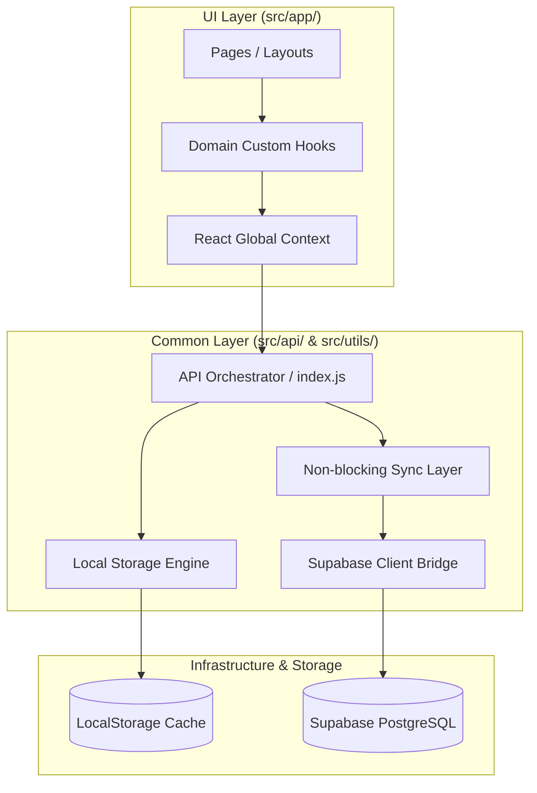

# 애플리케이션 아키텍처 명세서 (Application Architecture Specification)

본 문서는 MyVoca 애플리케이션의 핵심 계층 구조, 단방향 의존성 규칙, 그리고 UI 성능을 극대화하기 위한 낙관적 업데이트 및 백그라운드 비동기 서버 저장 기법의 설계 사양을 명세합니다.

---

## 1. 3대 레이어 계층 구조 (3-Layer Architecture)

MyVoca 애플리케이션은 각 레이어의 역할과 책임을 명확히 구분하고 테스트 및 유지보수성을 극대화하기 위해 다음과 같이 3개의 계층으로 소스 코드를 격리합니다.

| 계층 (Layer) | 역할 및 책임 | 주요 디렉토리 경로 |
| :--- | :--- | :--- |
| **1. UI 계층 (UI Layer)** | 리액트 컴포넌트 렌더링, 클라이언트 사이드 라우팅, 컴포넌트 격리 상태 및 훅을 통한 도메인 수명 주기 연동 | [src/app/](file:///z:/home/minhulee/Projects/funny-voca/funny-voca-app/src/app) |
| **2. 공통 비즈니스 계층 (Common Layer)** | 외부 서버 API 통신 게이트웨이, 로컬 스토리지 캐시 제어 엔진, 동기화 및 큐 매니저 백그라운드 연산, 포맷터 | [src/api/](file:///z:/home/minhulee/Projects/funny-voca/funny-voca-app/src/api), [src/utils/](file:///z:/home/minhulee/Projects/funny-voca/funny-voca-app/src/utils) |
| **3. 에셋 계층 (Assets Layer)** | 테마 설정, 이미지 및 공용 벡터 아이콘 리소스 등 상태 변화가 없는 정적 자원 | [src/assets/](file:///z:/home/minhulee/Projects/funny-voca/funny-voca-app/src/assets) |

---

## 2. 모듈 의존성 단방향 규칙 (One-Way Dependency Flow)

결합도 증가로 인한 스파게티 코드를 미연에 방지하기 위해 계층 간의 흐름은 철저히 상위에서 하위로만 단방향으로 흐릅니다.

### 2.1 상향 참조 금지 수칙
- 공통 비즈니스 계층(`src/api/`, `src/utils/`)은 UI 계층(`src/app/`)의 상태, 렌더링 엔진, 라우터 및 스타일 요소들을 직접 참조(import 등)할 수 없습니다.
- UI 컴포넌트는 LocalStorage 캐시나 Supabase DB에 직접 쿼리를 수행하지 않으며, 반드시 비즈니스 계층의 Orchestrator(`src/api/voca/index.js` 등) 및 전역 커스텀 훅을 통해서만 자원에 관여합니다.

---

## 3. 낙관적 업데이트 및 비동기 백그라운드 서버 저장

MyVoca는 네트워크 단선이나 API 응답 지연(RTT)에 관계없이 사용자에게 즉각적이고 매끄러운 반응성(0ms 레이턴시)을 보장하기 위해 **낙관적 업데이트(Optimistic Update)**와 **비동기 백그라운드 서버 저장(Non-blocking Async Sync)**의 결합 구조를 핵심 사상으로 취합니다.

### 3.1 동작 아키텍처 상세
- **Source of Truth 일원화**: 모든 단어장의 완료 토글, 스케줄 조정, 진도 마킹 등의 핵심 신뢰 상태는 **로컬 저장소 캐시(`voca`, `profile`)**에 직접 즉시 저장됩니다.
- **낙관적 선 반영**: 사용자가 이벤트를 발생시키면 로컬 저장소 캐시 엔진(`voca.local.js`)이 먼저 구동되어 로컬 스토리지에 데이터를 저장하고 UI 상태를 즉시 동기화해 응답 대기 로딩을 영구 제거합니다.
- **백그라운드 비동기 위임**: 로컬 1차 갱신 및 화면 렌더링이 즉각 끝난 직후, 비동기 오케스트레이션 인터페이스가 Supabase DB 백업을 백그라운드 단에서 넌블로킹 Promise로 단독 실행합니다. 이 서버 연산 과정 중 지연이나 일시적 단선 에러가 발생해도 사용자 화면 흐름에는 어떠한 오류도 노출되지 않습니다.
  - 구체적인 비동기 원격 백업 동기화 기법은 [sync.md](file:///z:/home/minhulee/Projects/funny-voca/funny-voca-app/.agents/sync.md) 문서를 참고합니다.

---

## 4. 백그라운드 단어 로딩 스케줄러 브릿지

- **점진적 백그라운드 로딩**: 초기 진입에 필수적인 최우선 청크 단어들만 라우터 로더에서 동기적으로 선제 쿼리해 0ms 렌더링을 유도하고, 나머지 전체 단어 사전 캐시는 백그라운드 큐 매니저가 점진적으로 가져와 로컬 마스터 캐시에 병합합니다.
- **WQM 큐 매니저 및 useMaster**:
  - `useMaster` 훅은 리액트 생명주기와 전역 백그라운드 큐 매니저(`WordQueueManager`)를 이어주는 넌블로킹 옵저버 브릿지입니다.
  - 상세한 단어 다운로드 큐 생성, 캐시 중복 선별 및 우선순위 격상(Re-queue) 메커니즘은 [queue.md](file:///z:/home/minhulee/Projects/funny-voca/funny-voca-app/.agents/queue.md) 문서를 참고합니다.

---

## 5. 데이터 라이프사이클 및 넌블로킹 전파 (Data Lifecycle & Route Context)

MyVoca는 리액트 컴포넌트의 렌더링 최적화와 화면 간 완벽한 정합성을 보장하기 위해, 리액트 라우터의 Loader 및 Revalidation 메커니즘을 아래의 수명 주기 규칙에 맞추어 운영합니다.

### 5.1 Loader 기반 초기 로드와 캐시 검사
- 사용자가 라우팅을 시도하는 시점에 라우터 로더(`loader`)가 선제 트리거됩니다.
- 로더 함수 내부에서는 로컬 스토리지(LS)의 캐시 데이터 유효성을 검사합니다.
  - 캐시가 유효하고 오염되지 않은 경우: 네트워크 통신을 거치지 않고 즉시 로컬 캐시 데이터를 리턴합니다.
  - 캐시가 유효하지 않거나 오프라인 충돌이 의심되는 경우: Supabase DB 서버를 호출해 최신 데이터를 수집하고 LS 캐시를 업데이트한 후 반환합니다.

### 5.2 App 영역의 상태(State) 배제와 컨텍스트 단순 전파
- 최상위 컨테이너인 `App.jsx` 영역은 유저 인터랙션에 반응하는 무거운 반응형 상태(`useState`)를 직접 갖지 않습니다.
- 로더를 통해 전달된 기본 정적 데이터(`useLoaderData()`)를 React Router의 `Outlet` context를 사용하여 트리 하단의 하위 자식 컴포넌트들에게 있는 그대로 일괄 흘려보냅니다 (Prop-drilling 배제).
- `OutletContext` 자체의 변화 감지 능력을 활용함으로써 최상위 레이어의 불필요한 상태 가공 및 리렌더링 부하를 원천 차단합니다.

### 5.3 핵심 컴포넌트들의 로컬 상태화 및 저장 격리
- 전달받은 데이터를 화면에 렌더링하는 핵심 컴포넌트(예: `VocaList`, `WordList`)들은 context로 유입된 정적 데이터를 각자의 로컬 생명주기 상태로 할당하여 렌더링합니다.
- 사용자의 조작(예: 단어 완료 클릭)에 따른 실시간 UI 반응성 업데이트는 각자의 화면 영역 내에서 먼저 빠르게 상태 변경이 처리되고, 실제 저장 절차(LS 캐시 저장 ➡️ DB 비동기 백업)는 별개의 독립적인 비동기 파이프라인으로 수행되어 UI 렌더링과 저장의 책임을 완전히 격리합니다.

### 5.4 Revalidation을 통한 전체 데이터 새로고침
- 데이터가 물리적으로 업데이트된 후, 로컬 상태와 원격 데이터 간에 동기화 완료 마킹이 끝나거나 전역 수준의 데이터 갱신이 필요할 때는 라우터의 `revalidate()`를 호출하여 `loader`를 강제로 새로 고칩니다.
- 이를 통해 캐시 상태가 상향식으로 안전하게 재로딩되며, 트리 상위의 `OutletContext`에 바인딩된 원본 데이터 객체가 일괄 교체되어 하위 컴포넌트들까지 자연스럽고 안전하게 최신 정보로 렌더링 동기화가 완료됩니다.

