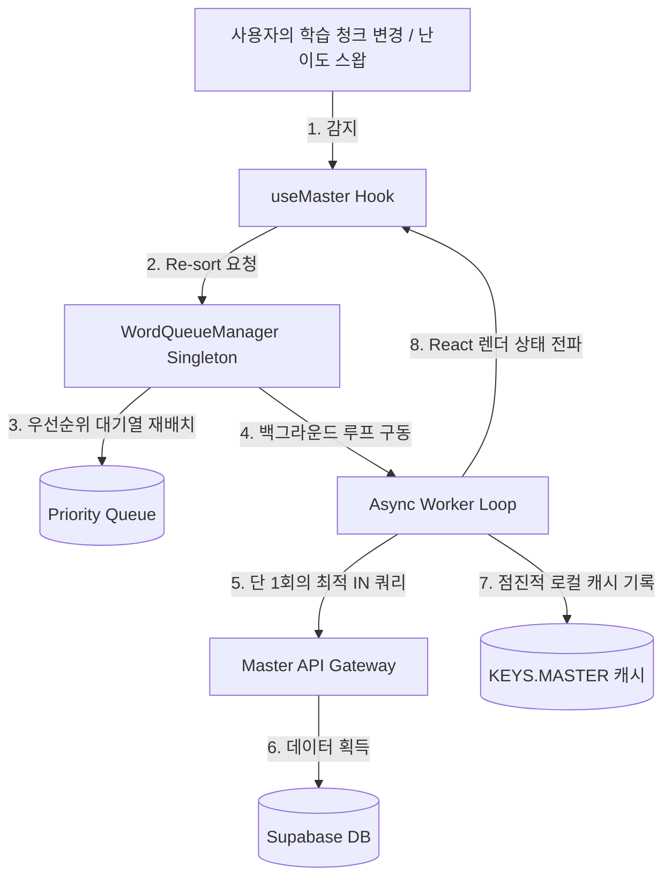

# 점진적 백그라운드 청크 로딩 아키텍처 명세서 (Progressive Background Chunk Loading Architecture)

본 문서는 MyVoca 애플리케이션의 핵심 단어 마스터 데이터 로딩 사양과 성능 최적화를 위한 넌블로킹 백그라운드 스케줄러 메커니즘을 명세합니다.

---

## 1. 개요 및 설계 사상

전통적인 방식의 무차별 전체 단어 목록 순차 다운로드(Bulk Streaming)는 과도한 네트워크 트래픽 발생, API 응답 속도 지연(1~3초), 그리고 리소스 유실 문제를 야기했습니다. 
이를 해결하기 위해 도입된 **점진적 백그라운드 청크 로딩 아키텍처**는 다음 핵심 사상을 따릅니다.
- **선제적 활성 데이터 확보**: 첫 화면 진입에 필수적인 1순위 청크 단어 데이터는 라우터 로더(`loadUserData`) 단계에서 API IN 쿼리를 사용해 사전에 로드하여 화면 렌더링 지연을 0ms로 수렴시킵니다.
- **비동기 점진적 수집**: 나머지 95% 이상의 학습용 대용량 영단어 상세 캐시는 백그라운드 워커를 돌려 렌더링에 영여를 주지 않으며 점진적으로 로컬 사전에 병합(Merge)합니다.
- **동적 가중치 스케줄링**: 사용자가 난이도를 바꾸거나 다른 카테고리를 학습하기 위해 우선순위를 변경하면 대기 큐를 실시간으로 재정렬하여 필요한 청크를 최우선 순위로 끌어올립니다.

---

## 2. 핵심 아키텍처 구성 요소

본 아키텍처는 전역 싱글톤 관리자, 리액트 전역 컴포넌트 훅, 그리고 마스터 게이트웨이 API의 3개 유기적 파트로 구성됩니다.

### 2.1 전역 Singleton 큐 매니저 (`WordQueueManager`)
`src/app/services/WordQueueManager.js`에 구현되어 있으며, 리액트 컴포넌트 생명주기와 완벽하게 분리되어 백그라운드 백그라운드 단어 로딩 루프를 실행합니다.

- **큐 필터링 및 분별 기능**:
  - `setVocaList(vocaList, selectedLabel)`이 실행되면, 이미 로컬 스토리지 마스터 캐시(`KEYS.MASTER`)에 모든 단어 정보가 완전히 보관되어 있는지 실시간으로 전수 검사합니다.
  - 캐시가 존재하는 청크는 다운로드 목록에서 즉각 **제외**하고, 온전하지 않은 청크들만 선별하여 `queue`에 적재합니다.
- **우선순위 재정렬 및 비집고 들어가기 (Priority Re-queue)**:
  - 큐의 적재 목록은 항상 아래 순위 가중치에 따라 내림차순으로 실시간 리소팅(Re-sort)됩니다.
    1. 사용자가 현재 선택하여 바로 암기를 개시해야 하는 액티브 청크 (`selectedLabel`과 매칭되는 청크)
    2. 학습 추천 권장 순번(`schedule`)이 빠른 청크 순서
  - 따라서 다운로드 워커 실행 중에 사용자가 암기 대상을 바꾸는 즉시 해당 변경 청크가 **대기열 가장 앞단에 비집고 들어와(Priority Re-queue)** 우선 다운로드됩니다.
- **워커 틱 미세 지연 제어**:
  - 메인 브라우저의 UI 렌더링 스레드가 급격한 다운로드 연산으로 인해 버벅이거나 멈추는 프레임 드랍을 막기 위해, 청크 다운로드 루프 틱마다 **`50ms` 미세 비동기 지연**을 부여하여 렌더링 엔진이 숨쉴 수 있는 리소스를 보장합니다.
- **자원 자동 소멸 Cleanup**:
  - 대기 큐의 미다운로드 청크들이 모두 정상적으로 다운로드 완료되는 시점 즉시, 백그라운드 프라미스 워커를 완벽히 소멸시키고 `activeWorker = null`로 할당하여 타이머 및 네트워크 스레드 누수를 사전에 영구 차단합니다.

### 2.2 넌블로킹 브릿지 훅 (`useMaster`)
`src/app/hooks/useMaster.js`에 정의되어 있으며, 전역 `WordQueueManager` 싱글톤 객체와 리액트 전역 컨텍스트 간의 연동 인터페이스 역할을 수행합니다.

- **옵저버 패턴 구독**:
  - 컴포넌트 마운트 시 `wordQueueManager.subscribe()`를 호출하여 백그라운드 다운로드가 완료될 때마다 통지되는 데이터 청크를 실시간으로 수신합니다.
  - 수신된 데이터는 리액트 상태인 `master`에 점진적으로 누적 병합(`Object.assign`)되어 실시간 화면 갱신을 주도합니다.
- **리스너 메모리 누수 제어**:
  - 리액트 생명주기가 만료되어 언마운트되는 시점에 맞춰 안전하게 구독을 파괴(`unsubscribe()`)함으로써 클라이언트 가비지 컬렉터의 안정성을 담보합니다.
- **동적 감지 바인딩**:
  - `vocaList` 또는 `selectedLabel`의 변경 상태를 `useEffect`를 통해 지속적으로 실시간 감시하며, 변화 발생 시 `JSON.stringify(vocaList)` 문자열 딥 비교 기법으로 감지하여 `WordQueueManager`에 대기열 갱신을 지연 없이 요청합니다.
