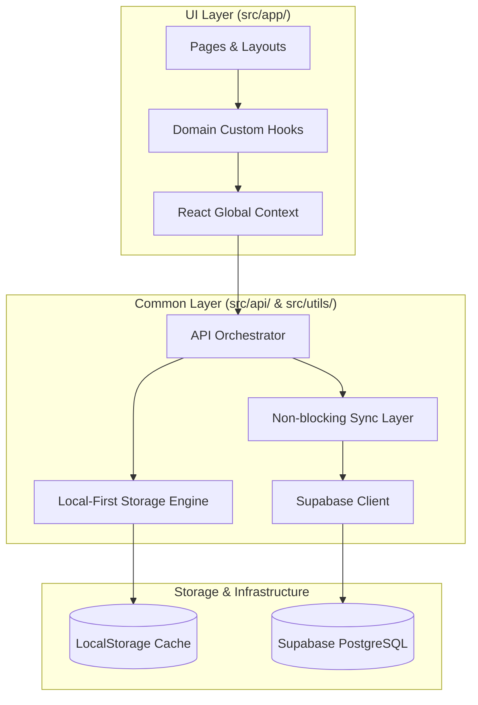

# 시스템 아키텍처 명세서 (System Architecture Specification)

본 문서는 MyVoca 애플리케이션의 전체적인 모듈 구조, 관심사 분리 정책 및 컴포넌트 간의 단방향 의존성 구조를 정의합니다.

---

## 1. 3대 카테고리 계층 구조 (3-Category Architecture)

MyVoca 애플리케이션의 모든 소스 코드는 역할과 책임을 명확히 구분하기 위해 다음 3가지 최상위 카테고리로 엄격하게 분리됩니다.

| 계층 (Layer) | 역할 및 책임 | 주요 디렉토리 경로 |
| :--- | :--- | :--- |
| **1. UI 계층 (UI Layer)** | 화면 렌더링, 클라이언트 사이드 라우팅, 컴포넌트 내부 및 전역 상태 관리, 커스텀 훅을 통한 도메인 라이프사이클 제어 | `src/app/` |
| **2. 공통 비즈니스 계층 (Common Layer)** | 외부 서버 API 통신, 로컬 저장소 캐시 제어, 핵심 비즈니스 로직 연산, 데이터 모델 포맷팅 및 가공, 범용 유틸 함수 | `src/api/`, `src/utils/` |
| **3. 에셋 계층 (Assets Layer)** | 이미지, 공용 SVG 아이콘 데이터, 테마 설정 등 영속적인 정적 리소스 | `src/assets/` |

---

## 2. 모듈 의존성 단방향 구조 (One-Way Dependency Flow)

시스템의 안정성과 교체 용이성을 확보하기 위해, 모듈 간의 결합을 방지하고 철저한 단방향 흐름을 유지합니다.

### 의존성 원칙 가이드라인

- **상향 참조 금지**: 공통 비즈니스 계층(`src/api/`, `src/utils/`)과 에셋 계층(`src/assets/`)은 UI 계층(`src/app/`)의 리액트 상태, 컴포넌트 구조, 스타일 가이드라인을 어떠한 형태(Import 등)로도 직접 참조할 수 없습니다.
- **저장소 구현 격리**: UI 컴포넌트는 LocalStorage나 Supabase DB에 직접 쿼리를 수행하지 않습니다. 반드시 `src/api/voca/index.js`와 같은 통합 API 인터페이스 및 커스텀 훅(`useVoca`, `useMaster` 등)을 통해서만 간접적으로 영속 상태에 관여합니다.
- **자유로운 이식성**: 공통 비즈니스 계층은 프레임워크나 렌더러에 종속되지 않으므로, 향후 React에서 Vue, Svelte 또는 React Native 등으로 프레임워크를 마이그레이션하더라도 `src/api/` 및 `src/utils/` 로직은 그대로 재사용할 수 있습니다.
