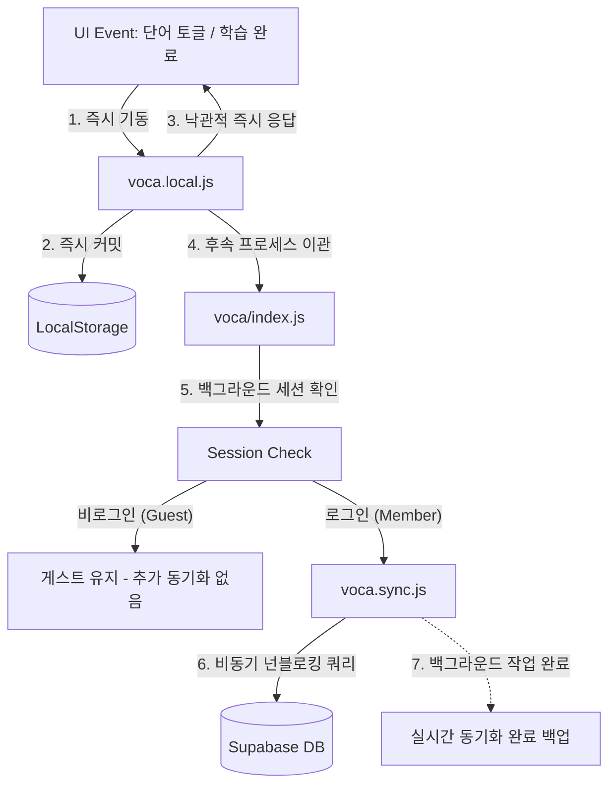

# 로컬 퍼스트 및 넌블로킹 동기화 아키텍처 명세서 (Local-First & Non-blocking Sync Architecture)

본 문서는 MyVoca 서비스의 핵심 데이터 영속성 처리 기법인 로컬 퍼스트 아키텍처와 백그라운드 넌블로킹 동기화 메커니즘, 그리고 데이터베이스 충돌 방지 기법을 명세합니다.

---

## 1. 로컬 퍼스트 (Local-First) 설계 원칙

MyVoca는 네트워크 연결 상태와 무관하게 사용자에게 0ms의 즉각적인 응답(낙관적 UI)을 제공하고 오프라인 가동을 기본으로 지원하는 **로컬 퍼스트 아키텍처**를 채택했습니다.

### 핵심 설계 상세
- **Source of Truth 일원화**: 모든 단어장의 상태 변경(완료 토글, 스케줄 조정, 레벨 초기화)의 근본적인 신뢰 처는 **로컬 스토리지 캐시(`KEYS.VOCA`, `KEYS.PROFILE`)**입니다.
- **낙관적 UI 업데이트**: 사용자가 단어를 클릭하는 순간 로컬 캐시 엔진(`voca.local.js`)이 즉각 기동되어 내부 연산을 마친 뒤 로컬 스토리지에 즉시 저장하고 리액트 상태를 갱신합니다. 서버 응답을 대기하는 로딩 스피너를 완벽하게 배제하여 네이티브 앱 수준의 사용성을 달성합니다.

---

## 2. 넌블로킹 동기화 레이어 (Non-blocking Sync Layer)

로컬 캐시가 즉시 반영되어 화면이 갱신된 직후, 원격 Supabase DB로의 백업은 백그라운드 비동기 동기화 레이어(`voca.sync.js`)가 단독 처리합니다.

### 오케스트레이션의 분리 정책 (`voca/index.js`)
- `src/api/voca/index.js`는 최상단 오케스트레이터 인터페이스로서 `getLocalVocaList` 및 `updateLocalWordStatus`를 먼저 호출해 로컬 캐시를 1차 업데이트합니다.
- 이후 `getSession().then(...)` 체인을 실행하여 비동기 스레드 수준에서 비동기 프로필 백업 및 퀴즈 완료 동기화를 요청합니다.
- 이 과정에서 발생할 수 있는 원격 API 실패 또는 지연 오류는 사용자 화면 흐름에 어떠한 영향을 끼치지 않고 내부 Catch 로그로 격리되어 시스템의 전반적인 결함 포용력(Fault Tolerance)을 극대화합니다.

---

## 3. 3단계 임시 음수 치환을 통한 유니크 충돌 예방 기법

Supabase 데이터베이스에서 사용자별 정렬 순위(`schedule` 칼럼)는 `user_id`와 복합 고유(UNIQUE) 제약 조건을 가집니다. 사용자가 단어장의 정렬 순서를 바꾸는 카테고리 스왑(Reschedule) 연산을 수행할 때, 일시적으로 동일한 schedule 값이 생성되어 DB 유니크 제약 오류가 발생하는 빈번한 버그를 차단하기 위해 **3단계 임시 음수 치환 트랜잭션** 기법을 적용합니다.

### 3.1 카테고리 스왑 시 3단계 동작 프로세스

두 카테고리(예: A와 B)의 학습 순번을 상호 교환할 때, DB 엔진의 정합성을 보존하는 흐름은 다음과 같습니다.

| 단계 | 수행 작업 | 상세 로직 |
| :--- | :--- | :--- |
| **1단계** | **A 카테고리 임시 음수 치환** | A 카테고리에 속한 모든 행의 `schedule` 칼럼 값을 임시 음수 일련번호(예: `-1`, `-2`, `-3`)로 선제 UPDATE 합니다. 이로써 A 카테고리는 유니크 정수 공간에서 완전히 이탈합니다. |
| **2단계** | **B 카테고리 양수 치환** | B 카테고리에 속한 행들의 `schedule` 칼럼 값을 A 카테고리가 사용하고 있었던 원래의 정수 `schedule` 값으로 UPDATE 합니다. (이때 A는 모두 음수이므로 충돌이 절대 발생하지 않습니다.) |
| **3단계** | **A 카테고리 최종 교환 완료** | 임시 음수값으로 치환해 두었던 A 카테고리 행들의 `schedule` 칼럼 값을 B 카테고리가 쓰던 원래의 정수 `schedule` 값으로 최종 UPDATE 합니다. |

### 3.2 레벨 마이그레이션(rescheduleLocal/syncRescheduleToRemote) 시 충돌 우회
난이도 전체 변경이나 초기화 시에도 기존의 중복 행들과 유니크 제약이 겹치는 것을 원천 차단하기 위해, 수정 대상이 되는 행의 `schedule`을 `-(i + 100)` 계열의 임시 음수값으로 전면 일괄 변환하여 DB 정밀 UPDATE를 진행하고, 이후 양수 복합 schedule을 촘촘히 순차 재배열함으로써 무결성을 100% 보장합니다.
