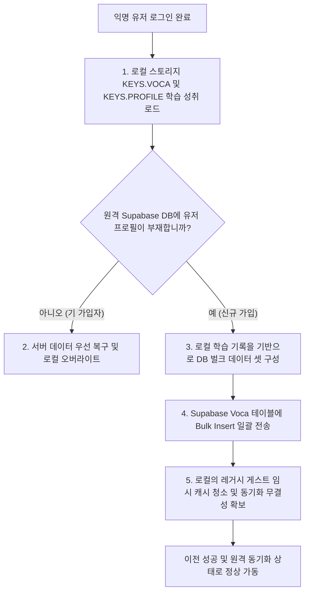

# 데이터 마이그레이션 및 자동 포팅 명세서 (Data Migration & Auto-Porting Specification)

본 문서는 익명(게스트) 사용자가 정식 회원(Member)으로 가입하거나 전환할 때 수행되는 데이터 마이그레이션 절차와, 구버전 잔재 데이터와의 호환성을 확보하기 위해 로더 계층에 구현된 예외 포팅 복구 로직을 정의합니다.

---

## 1. 회원 전환 시 데이터 마이그레이션 (Guest-to-Member Migration)

비로그인 상태에서 서비스를 체험하던 게스트 사용자가 회원가입 및 로그인을 완료하는 즉시, 로컬 브라우저에 파편화되어 존재하던 학습 진행 이력을 원격 Supabase DB로 손실 없이 전송 및 통합하는 마이그레이션 파이프라인(`src/api/migration/` 또는 관련 모듈)이 기동됩니다.

### 1.1 마이그레이션 상세 시퀀스

게스트에서 정식 회원으로 가입 전환 시 진행되는 데이터 이전 흐름은 다음과 같습니다.

### 1.2 안전 장치 및 트랜잭션 보장
- **원격 우선 정책**: 만약 서버에 이미 학습 기록 데이터가 일부라도 존재한다면, 로컬 데이터를 덮어쓰는 대신 서버의 원격 데이터를 우선 복구하도록 구현되어 데이터를 보호합니다.
- **클린업 가이드**: DB 이송 및 유효성 대조가 최종적으로 오차 없이 완료된 마일스톤 완료 틱에만 로컬의 게스트 임시 데이터셋을 삭제하고, 이후 모든 Voca 조회 API는 원격 DB에 넌블로킹 동기화 백업을 수행하는 정식 회원 비즈니스 로직(Sync Layer)으로 완벽하게 전환됩니다.

---

## 2. 레거시 ID 자동 포팅 및 복구 방어 로직 (Legacy Selected Auto-Porting)

애플리케이션의 3차 아키텍처 리팩토링 단계에서, 기존의 불완전한 숫자 인덱스(예: `selected: 0` 등) 기반의 단어장 식별 메커니즘을 완전히 폐기하고 **영문 고유 문자열 ID(Slug) 규격**을 새롭게 이식했습니다. 
기존 브라우저 로컬 스토리지에 구버전 데이터 구조가 고스란히 남아 있는 레거시 사용자들의 웰컴 페이지 무한 리다이렉트 충돌이나 단어 로딩 실패 장애를 막기 위해, 앱 진입 전역 로더(`loadUserData`) 최상단에 강력한 **복구 방어 코드(Auto-Porting Bridge)**가 상시 대기하고 있습니다.

### 2.1 예외 데이터 포팅 및 복구 프로토콜

로더 구동 단계에서 구버전 데이터를 최신 규격으로 복구하는 세부 처리 기준은 다음과 같습니다.

| 감지 항목 | 비정상 데이터 패턴 | 복구 프로세스 및 매핑 동작 |
| :--- | :--- | :--- |
| **선택 청크 키 (`profile.selected`)** | `0`, `1`, `2` 등 숫자 정수 타입 또는 순수 인덱스 문자열 타입 감지 | `getLocalVocaList`를 기동하여 새로이 산출된 700 레벨의 1차 청크 영어 고유 ID(예: `700-marketing_1`)를 역산 매핑하여 로컬 스토리지 프로필을 즉시 강제 덮어쓰기 복구합니다. |
| **단어장 리스트 (`voca`)** | 구 `wordMaps` 배열 형태의 객체 구조나 누락된 필드가 있는 레거시 템플릿 | 전체 키를 삭제하고 Supabase의 마스터 스케줄러 기반으로 최신 구조의 3대 레벨 그룹화 객체 구조(`{ 700: [], 800: [], 900: [] }`)로 재생성하여 로컬 정합성을 맞춥니다. |

### 2.2 방어 코드 탑재 목적
- **무장애 런타임**: 사용자가 앱을 업데이트하고 최초 재진입하는 순간, 사용자 인지 없이 무진동으로 로컬 스키마 마이그레이션이 수행되므로 사용자 경험(UX) 단절을 방지합니다.
- **예외 복구 격리**: 로더 단에서 이상 데이터를 격리 복구한 뒤 렌더링에 이양하므로, 하위 리액트 페이지 및 개별 단어 컴포넌트는 오직 통일된 최신 ID 규격만을 엄격히 가정하고 동작할 수 있게 되어 하위 호환성 유지용 스파게티 코드가 컴포넌트 깊숙한 곳까지 퍼지는 오염을 차단합니다.
