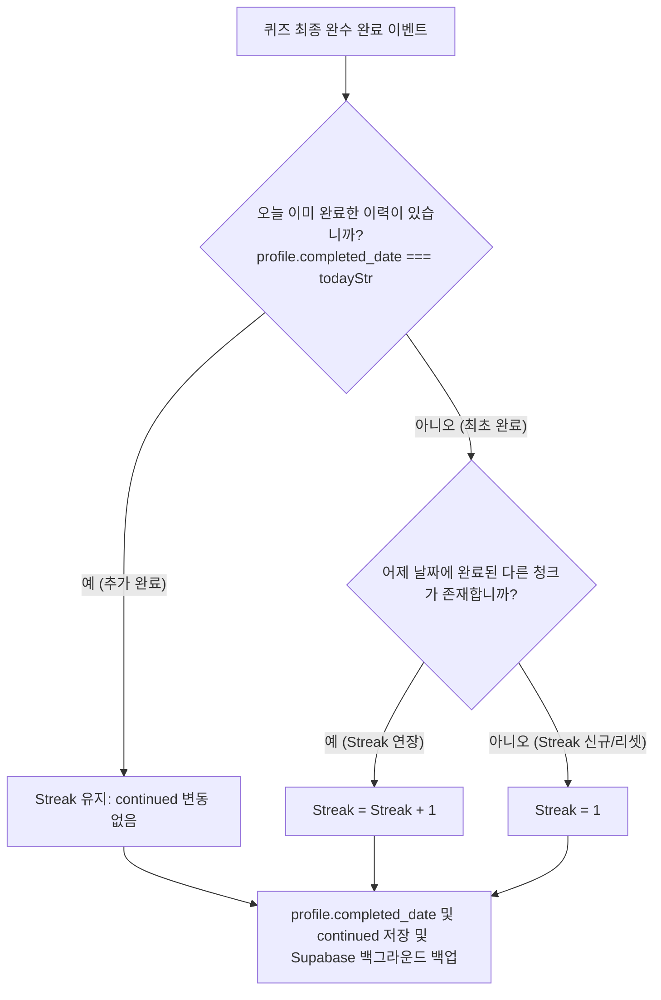

# 학습 완료 및 연속 달성 비즈니스 로직 명세서 (Study Achievement & Streak Business Logic)

본 문서는 사용자가 단어 학습 및 최종 퀴즈를 완료하는 순간 동작하는 퀴즈 완수 마킹 프로세스, 연속 학습 일수(Streak) 연산, 그리고 현재 지정 청크의 자동 전진 메커니즘을 상세 명세합니다.

---

## 1. 퀴즈 완수 시 학습 달성 처리 (Study Completion Process)

MyVoca는 단어 암기 도중 개별 단어의 토글 상태 변경(Word 완료) 시점과 40개 전체 청크에 대한 퀴즈 완수(Chunk 완료) 시점의 비즈니스 플로우를 완벽하게 이원화하여 관리하며, 오답 발생 여부에 따른 실시간 캐싱과 최종 무결점 완수 규칙을 적용합니다.

### 1.1 암기 토글 및 실시간 퀴즈 정답 연산 (`updateLocalWordStatus`)
- 사용자가 학습 모드 중 개별 단어의 암기를 완수하거나, **퀴즈 진행 중 최초 시도에 단 한 번의 오답도 없이 바로 정답을 맞춘 단어** (`hasMistake === false`)인 경우 즉시 `updateStatus`를 호출하여 LocalStorage `done` 배열에 단어 ID를 실시간 캐싱합니다.
- 퀴즈 도중 단 한 번이라도 오답을 냈던 단어는 결국 다시 맞춰 넘어가더라도 이 퀴즈 세션에서는 `done` 배열에 추가하지 않고 탈락시킵니다.

### 1.2 퀴즈 최종 완수 연산 (`updateLocalVocaStatus` / `syncVocaStatusToRemote`)
- 사용자가 퀴즈 3단계(Sentence)의 마지막 문항까지 성공적으로 통과하여 COMPLETE 페이즈로 전환되는 순간 청크 완수 판별이 수행됩니다.
- **판단 조건**: 오답 없이 바로 맞춘 단어 수(`done.length`)가 해당 청크의 전체 단어 수(`word.length`)와 정확히 일치할 때에만 청크가 완벽히 완수된 것으로 인정합니다.
- **`status` 필드**: `true`로 마킹되어 단어장 목록에서 완료 상태로 시각화됩니다. (오답이 하나라도 있다면 `false`로 유지)
- **`completed_at` 필드**: `YYYY-MM-DD` 규격의 오늘 날짜 문자열이 기록되어 학습 캘린더 점등 데이터로 영구 보관됩니다. (오답이 있다면 `null` 유지)
- **LocalStorage 반영 후 Supabase 백그라운드 동기화 흐름**을 단 1회의 원샷 API 호출로 원자적(Atomic)으로 처리합니다.

---

## 2. Streak (연속 학습일) 계산 및 중복 방지 알고리즘

사용자의 꾸준한 영단어 학습을 격려하고 동기를 유발하기 위해 고도화된 **연속 학습 달성도(Streak) 계산 로직**이 탑재되어 있으며, 하루에 여러 청크를 완수하더라도 Streak이 하루에 단 1일만 증가하도록 **당일 중복 가산 방지 방어 코드**를 구현합니다.



### 2.1 날짜 산출 및 대조 규칙
타임존 왜곡이나 가입 시점 차이로 인한 역산 오차 오류를 근본적으로 해소하기 위해, 날짜 계산 연산을 단순 캘린더 일차(YYYY-MM-DD) 대조 방식으로 규격화했습니다.

- **어제 날짜 구하기 공식**:
  ```javascript
  const msToDay = 86400000;
  const yesterday = new Date(Date.now() - msToDay);
  const yStr = String(yesterday.getFullYear());
  const mStr = String(yesterday.getMonth() + 1).padStart(2, "0");
  const dStr = String(yesterday.getDate()).padStart(2, "0");
  const yesterdayStr = `${yStr}-${mStr}-${dStr}`;
  ```
- **Streak 갱신 및 중복 가산 방지**:
  - 오늘 최초 완수 시 (`profile.completed_date !== todayStr`): 현재 학습 중인 레벨의 전체 Voca 리스트 중 `completed_at` 값이 `yesterdayStr`과 정확히 일치하는 레코드가 존재하면 `continued = continued + 1`, 그렇지 않다면 `continued = 1`로 신규 설정합니다. 완료 즉시 `profile.completed_date = todayStr`로 인장을 남겨 당일 연속 완료 상태를 안전하게 보호합니다.
  - 오늘 추가 완수 시 (`profile.completed_date === todayStr`): Streak(`continued`)을 더 이상 가산하지 않고 현재 상태를 그대로 유지하여 하루에 여러 청크를 클리어하더라도 하루에 1일만 누적되도록 제한합니다.
- **원격 DB 동기화**: 로컬 프로필의 `continued` 값이 Supabase `User.continued` 컬럼에도 정확히 동기화되도록 연동합니다.

---

## 3. 학습 타겟 청크 자동 전진 (Auto-Advance) 및 스킵 규칙

퀴즈 완료 프로세스가 정상 처리되는 즉시, 사용자가 홈 화면이나 암기 모드 진입 시 즉시 공부할 수 있도록 현재 학습 지향점(`profile.selected`)을 자동으로 다음 단계로 포워딩합니다.

### 3.1 타겟 청크 탐색 우선순위

전체 목록에서 다음 학습할 미션지를 도출하는 필터링 조건은 다음과 같습니다.

| 우선순위 | 판단 조건 및 탐색 알고리즘 |
| :--- | :--- |
| **1순위 (기본 동작)** | 현재 활성화된 레벨의 청크 목록을 `schedule` 필드 오름차순으로 오프라인 정렬한 후, **`status === false` (미완료)**인 가장 첫 번째 청크 라벨을 탐색합니다. |
| **2순위 (목표 도달)** | 현재 레벨의 모든 청크에 대해 `status === true`로 완수한 경우, 자동 전진을 멈추고 `profile.selected`는 그대로 마지막 완료 청크의 상태를 유지하여 중복 전진으로 인한 렌더 에러를 예방합니다. |

### 3.2 로더 캐시 바인딩 및 프로필 연동
동기화 복구 세션이나 로더(`loadUserData`) 구동 단계에서도, Supabase 데이터베이스의 실시간 `continued` 데이터와 `selected` 타겟 값이 로컬 캐시 프로필(`KEYS.PROFILE`) 영역에 단 1바이트의 오차도 없이 일치하도록 양방향 매핑 코드를 지원하여 전체 데이터 일관성을 수호합니다.
