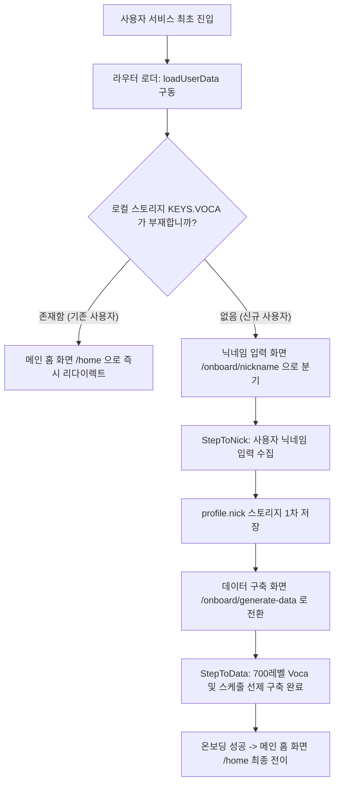

# 신규 사용자 온보딩 시나리오 명세서 (New User Onboarding Scenario)

본 문서는 MyVoca 서비스를 최초로 시작하는 사용자의 온보딩 과정과 초기 학습 데이터 세트의 자동 구축, 그리고 라우팅 분기 흐름을 상세하게 명세합니다.

---

## 1. 전체 온보딩 제어 흐름 (Onboarding Flow)

신규 사용자가 메인 홈 화면에 최종 진착하기 전 거치는 닉네임 수집 및 초기 학습 데이터 강제 생성 단계입니다.

---

## 2. 세부 스텝별 컴포넌트 명세

### 2.1 닉네임 입력 화면 (`src/ui/common/setup/StepToNick.jsx` 또는 관련 모듈)
- **목적**: 사용자가 서비스 내부에서 호칭될 개성 넘치는 닉네임을 수집하는 기본 웰컴 터미널입니다.
- **주요 로직**:
  - 입력창의 공백 검증 및 불필요한 특수문자 차단 필터링을 거칩니다.
  - 닉네임 확정 버튼을 누르면 로컬 저장소 프로필 캐시(`KEYS.PROFILE`) 객체 내에 `nick` 속성을 즉시 기록하고 온보딩 2단계인 데이터 생성 단계로 안전하게 포워딩합니다.

### 2.2 학습 데이터 자동 구축 화면 (`src/ui/common/setup/StepToData.jsx` 또는 관련 모듈)
- **목적**: 닉네임 등록 직후, 첫 화면 안착 시 사용 가능한 학습 템플릿과 1차 암기 대상 단어 데이터 사전 캐시를 선제적으로 수집하는 넌블로킹 프리 로딩 터미널입니다.
- **세부 비동기 스키마 생성 흐름**:
  1. **마스터 로드**: `common/api/common/master.js` 혹은 그에 준하는 마스터 게이트웨이를 호출하여 전체 어휘 메타 테이블을 탐색합니다.
  2. **디폴트 700 레벨 선제 셋업**: 기획상 최초 진입 권장 레벨인 **`700`** 레벨에 연계된 모든 Chunk 데이터를 필터링합니다.
  3. **초기화 및 스케줄 계산**: `calculateNewSchedule` 함수를 작동하여, 권장 카테고리 순번을 기반으로 해당 레벨의 전체 청크들에 1부터 N까지 촘촘한 `schedule` 값을 부여합니다.
  4. **영속성 캐싱 및 로더 선제 획득**:
     - **로컬 커밋**: 정렬 연산 결과로 가공된 3대 레벨 그룹화 맵(`{ 700: [...], 800: [], 900: [] }`)을 `KEYS.VOCA`에 영구 캐싱합니다.
     - **선제 쿼리 다운로드**: 1차 타겟 청크의 단어 상세 정보(Word + Definition 조인 데이터)를 Supabase `IN` 쿼리로 즉시 대량 선제 인출하여 `KEYS.MASTER` 캐시에 고정합니다.
  5. **프로필 상태 초기값 고정**: `KEYS.PROFILE` 객체 내에 활성 난이도(`level: 700`), 현재 활성 청크(`selected: "700-xxx_1"`), Streak(`continued: 0`), 완료 날짜(`completed_date: null`) 등의 전역 프로필 상세를 완벽하게 고정합니다.

---

## 3. 온보딩 아키텍처의 비즈니스 이점

- **지연 인지 배제 (No Fake Loading)**:
  - 기존 Welcome 단계에서 가짜 지연 스피너를 보여주며 렌더링을 늦추던 레거시 방식을 철폐했습니다.
  - 라우터 진입 로더(`loadUserData`) 단계에서 모든 700 레벨 Voca 스케줄을 완벽하게 빌드하고 1순위 청크 단어들까지 미리 로드해 두므로, 온보딩 단계를 통과하여 대시보드 홈 화면에 도달하는 첫 마운트 시점에 **로딩 렉 없이 즉시 첫 단어가 노출**되는 혁신적인 성능을 보장합니다.
- **안정적 오프라인 시드 보장**: 최초 온보딩 단계를 넘어가면, 이후 사용자가 통신이 불가한 오프라인 상태나 터널 속으로 진입하더라도 1차적으로 배정된 영단어 학습을 어떠한 통신 장애 없이 완전하게 끝마칠 수 있습니다.
