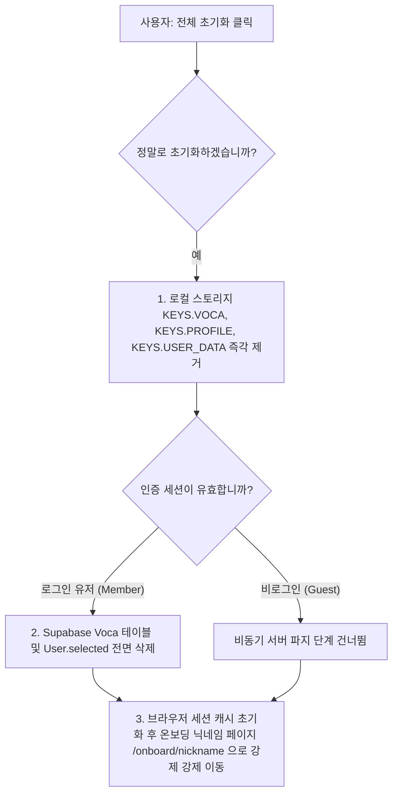

# 설정 변경 및 공장 초기화 시나리오 명세서 (Settings Change & Factory Reset Scenario)

본 문서는 사용자가 설정 화면에서 학습 난이도(레벨)를 변경하거나, 모든 학습 내역을 포맷하는 공장 초기화를 수행할 때 일어나는 실시간 진행률 피드백 및 자원 완전 파지 프로세스를 명세합니다.

---

## 1. 학습 난이도 변경 및 실시간 진행률 연동 (Level Change & Real Progress)

사용자가 설정 메뉴(`/settings`)에서 목표 점수대(예: 700점 -> 800점)를 변경하면, 시스템 내부에서는 대규모 데이터 스왑 및 스케줄 재구성 연산이 백그라운드로 트리거됩니다. MyVoca는 마이그레이션이 끝날 때까지 무조건 돌리는 가짜 스피너 방식 대신, 실제 완료도를 실시간으로 추적하는 **진짜 진행률(Real Progress) 동기화 피드백**을 적용했습니다.

### 1.1 난이도 변경 및 재조정 상세 흐름

레벨 상향/하향 조정 요청 시 작동하는 데이터 파이프라인 단계는 다음과 같습니다.

| 단계 | 수행 로직 및 연산 상세 | 진행율 피드백 (`onProgress`) |
| :--- | :--- | :--- |
| **1단계: 로컬 1차 갱신** | 로컬 프로필 캐시(`KEYS.PROFILE`)의 `level` 속성을 즉각 갱신하고, 로컬 스토리지 데이터(`KEYS.VOCA`)의 타겟 레벨 스케줄링을 완료합니다. | 게스트는 가짜 지연 없이 **100%** 완료 |
| **2단계: 원격 초기화** | 로그인 세션 감지 시, `syncRescheduleToRemote` 동기화 스케줄러가 구동되어 목표 레벨 범위를 벗어나는 구버전 원격 Voca 레코드를 데이터베이스에서 Drop합니다. | **10% ~ 40%** 진행율 수집 및 갱신 |
| **3단계: 유니크 우회 치환** | Supabase 유니크 충돌을 차단하기 위해, 갱신이 예정된 기존 레코드들의 schedule을 음수 정수(`-(i + 100)`)로 일시 치환 UPDATE를 수행합니다. | **55% ~ 70%** 진행율 수집 및 갱신 |
| **4단계: 벌크 삽입 및 양수화** | 새로 추가되는 카테고리 청크들을 DB에 Bulk Insert하고, 음수로 치환되었던 행들의 정수 schedule 값을 촘촘히 실시간 양수로 재치환 정비합니다. | **85% ~ 100%** 최종 도달 완료 |

### 1.2 진짜 진행률(Real Progress) 연동의 이점
- UI 계층은 비동기 API로부터 전달받는 `onProgress` 백분율 피드백 콜백을 받아 로딩 UI 바를 부드럽고 정확하게 갱신하므로, 사용자는 데이터 전송 세션이 실제로 멈추지 않고 매끄럽게 흐르고 있음을 명확하게 인지하게 됩니다.
- 동기화 완료 즉시, 새로 구성된 레벨 단어장의 최우선 타겟 청크(`vocaList[level]?.[0]`) 정보가 프로필 `selected`에 세팅되어, 홈 화면 대시보드의 "암기하기" 활성 목표가 즉시 스와핑됩니다.

---

## 2. 학습 데이터 전체 초기화 (Factory Reset)

사용자가 학습 의욕 고취나 오염 데이터 정리를 이유로 단어장 "초기화" 버튼을 클릭할 시 작동하는 전면 파지 비즈니스 프로토콜입니다.

### 2.1 공장 초기화 시나리오 (`resetVoca`)

리액트 커스텀 훅 `useVoca` 내에 정의되어 있으며, 로컬 브라우저와 원격 서버의 소유 자원을 원천적으로 포맷하는 흐름입니다.

### 2.2 자원 완전 파지 정책의 안정성
- **선 로컬 파지 후 서버 위임**: 네트워크 연결 순단 상태에서 공장 초기화가 불발되는 런타임 행(Hang) 현상을 영구 배제하기 위해, **로컬 캐시 삭제를 최우선**으로 완료 처리한 뒤 Supabase DB 행 삭제는 백그라운드 프라미스 파이프로 밀어냅니다.
- **오프라인 동작 완결**: 오프라인 상태에서도 로컬 데이터 파지는 100% 즉시 완료되므로, 사용자는 언제나 지체 없이 신규 온보딩 라이프사이클로 정상 전입할 수 있는 완벽한 안정성을 가집니다.
