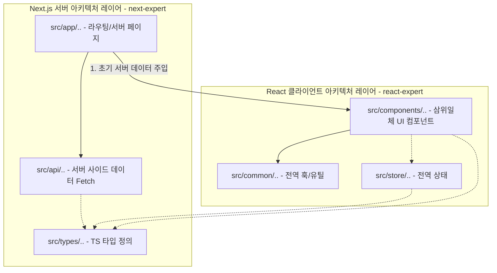

# app-architecture-expert 스킬 가이드

## [에이전트 전용: 빌드 타임 자동화 워크플로우 지침]
에이전트는 사용자가 신규 프로젝트 환경 구축(Build / Setup / Init) 또는 아키텍처 공통 설정을 지시했을 때, 실질적인 코드 작성을 수행하기 전 최우선으로 다음 워크플로우를 완수해야 한다.

1. **[룰 자동 이식]**: 본 스킬 패키지 하위의 `rules/app-architecture-rule.md` 파일을 타겟 프로젝트의 `.agents/rules/app-architecture-rule.md` (또는 `rules/` 디렉토리) 하위로 자동 복사(write_to_file)한다.
2. **[검증]**: 타겟 프로젝트의 규칙 폴더에 파일이 무결하게 생성되었는지 확인한 뒤, 안티그래비티 감시 엔진의 자동 감지가 개시되었음을 보고하고 본격적인 개발 코딩 단계에 진입한다.

---

## 1. 하이브리드 아키텍처 레이어 검토 및 조립 지침

에이전트는 프로젝트 착수 단계에서 다음 의존성 위계 및 데이터 단방향 흐름 맵을 기준으로 아키텍처 상태를 진단하고 레이어를 설계해야 합니다. 특히 Next.js(서버 뼈대)와 React(클라이언트 알맹이)가 결합된 환경에서는 **"서버에서 클라이언트로 흐르는 단방향 의존성 위계"**를 철저히 고수합니다.



### 1) 레이어 구성 자가 진단 체크리스트
에이전트는 프로젝트 시작 시 다음 질문을 통해 적합한 레이어를 도출합니다.
- [ ] **Q1. Next.js App Router 생태계를 사용하는 프로젝트인가?**
  - **Yes**: `next-expert`를 병행 가동하여 최상단 골격(`src/app/` 하위)은 순수 서버 컴포넌트로 두고, 비동기 데이터 페칭을 전담하게 합니다.
  - **No**: 리액트 단독 SPA 환경이므로 `react-expert` 단독 체제로 기동하며, 라우터 및 데이터 바인딩 시 사전 로더(Loader) 아키텍처를 활성화합니다.
- [ ] **Q2. Zustand, Redux 등 전역 상태 관리가 필요한가?**
  - **Yes**: `src/store` 디렉토리를 구축하여 비즈니스 데이터의 상태 변화 로직을 UI 렌더링 코드와 엄격히 분리하되, 해당 상태 훅은 오직 클라이언트 컴포넌트(`"use client"`) 영역 내부에서만 호출하도록 통제합니다.

---

## 2. 의존성 격리 및 역방향 오염 방지 실무 가이드

에이전트는 코드 작성 및 리팩토링 시 아래의 의존성 위반 여부를 정밀 체크하여 아키텍처 오염을 원천 차단해야 합니다.

### 1) 서버에서 클라이언트로의 단방향 통제 (상향 임포트 금지)
* **규칙**: 서버 컴포넌트 및 순수 서버 유틸리티(`src/api`)는 **어떠한 경우에도 클라이언트 전용 라이브러리나 런타임 CSS-in-JS 스타일, 클라이언트 훅을 임포트(import)해서는 안 됩니다.**
* **에이전트 자가 검사**:
  * 리팩토링 수행 시, 서버 컴포넌트 영역에서 `"use client"` 지시어 없이 클라이언트 전용 자산(예: `styled-components`, `useState` 기반 훅 등)을 상향 임포트하여 컴포넌트가 폭발하지 않는지 정적 진단을 상시 수행합니다.

### 2) 훅(Hooks) 배치 및 범위 격리 기준
커스텀 훅의 용도와 실행 환경을 명확히 판정하여 적절한 폴더에 자동 격리합니다.
* **도메인 한정 클라이언트 훅 (Local Hook)**:
  * 예: `useBoard.ts` (특정 게시판 컴포넌트의 클릭/필터링 상태 전담) -> `src/components/Board/hooks/useBoard.ts` 하위로 밀착 격리하고 해당 컴포넌트가 `"use client"` 바운더리에 있음을 확인합니다.
* **전역 공용 훅 (Global Hook)**:
  * 예: `useTheme.ts` (다크모드 스위칭) -> `src/common/hooks/useTheme.ts`로 격리합니다.

---

## 3. API 및 도메인 격리 설계 기법
API 코드를 작성할 때는 파일 하나에 모든 호출 함수를 쑤셔 넣지 말고, 데이터를 다루는 도메인 단위로 정교하게 격리합니다.
```
src/api/
├── user/
│   ├── index.js     # User 관련 API 엔트리
│   └── auth.js      # 로그인/로그아웃 관련 상세 함수
└── board/
    ├── index.js     # 게시판 관련 API 엔트리
    └── comment.js   # 댓글 관련 상세 함수
```
* 도메인 API 레이어를 뷰 레이어와 완전 격리함으로써, 백엔드 데이터 모델의 스펙 변경 시 UI 코드의 오염 없이 관련 영향 범위를 도메인 내부로 엄격히 통제할 수 있습니다.
