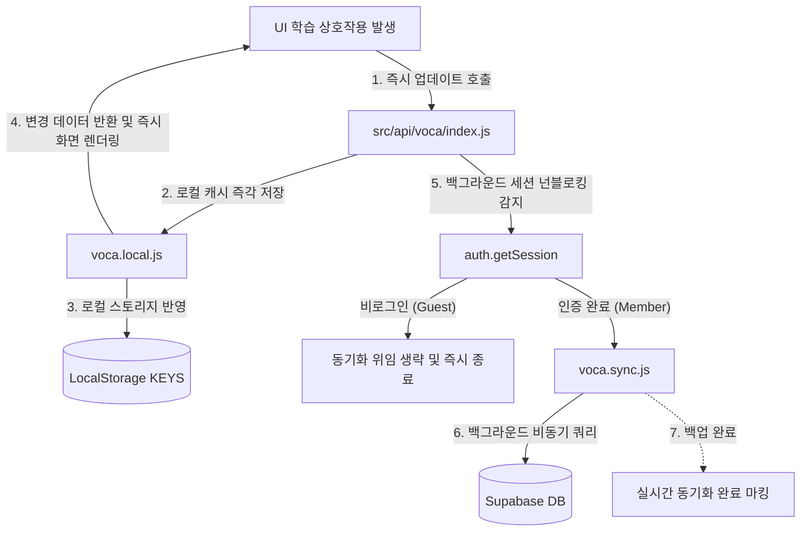

# 데이터 동기화 명세서 (Data Synchronization Specification)

본 문서는 로컬 캐시를 1차로 갱신하여 UI 화면을 응답 지연 없이 먼저 갱신한 뒤, 백그라운드 스레드에서 원격 Supabase DB로 학습 진도 및 성취 데이터를 안전하게 백업 및 동기화하는 오케스트레이션 메커니즘을 명세합니다.

---

## 1. 낙관적 로컬 우선 반영 및 백그라운드 위임 흐름

MyVoca는 네트워크 감도나 지연 시간(RTT)에 의해 사용성 흐름이 차단(로딩 스피너 노출 등)되는 현상을 영구 차단하기 위해 모든 핵심 API 인터페이스에서 아래와 같은 동기화 파이프라인을 운영합니다.

### 1.1 로그인 세션 여부에 따른 분기 메커니즘
1. **인증 완료 사용자 (Member)**
   - 로컬 상태 반영이 끝난 뒤 `getSession().then(session => { ... })` 프라미스 체인을 통해 비동기 백그라운드 스레드로 진입합니다.
   - `sync.js` 내의 비동기 백업 함수(`syncVocaStatusToRemote`, `syncRescheduleToRemote` 등)가 호출되어 Supabase DB 테이블(`Voca`, `User`)의 관련 레코드를 갱신합니다.
2. **비로그인 사용자 (Guest)**
   - 세션이 존재하지 않으므로 원격 동기화 과정을 생략하고 즉시 흐름을 완결합니다.
   - 설정 변경 등 진짜 진행률(`onProgress`) 수집이 필요한 경우, 별도의 지연 대기 세션 없이 즉시 100% 콜백을 실행하여 반응성을 유지합니다.

---

## 2. 장애 방어적 백업 및 결함 포용력 (Fault Tolerance)

네트워크 단선, 일시적 클라우드 서버 지연, API 한도 초과 등의 예외가 원격 Supabase 쿼리 도중에 발생하더라도 클라이언트 애플리케이션의 정상 동작을 100% 보장하도록 정교한 예외 Catch 차단 정책을 적용합니다.

### 2.1 넌블로킹 Promise 분리 규칙
- 원격 동기화를 수행하는 모든 함수 호출은 `await`로 메인 렌더링 스레드를 블로킹(Blocking)하지 않고, 반드시 **백그라운드 비동기 프라미스 체인(`Promise.then().catch()`)**으로 호출을 이관하여 독립적으로 연산합니다.
- 동기화 도중 발생한 모든 에러는 화면에 경고 창이나 레이아웃 붕괴를 초래하지 않고, 공통 에러 로그(`console.error`) 영역으로 안전하게 격리(Isolation) 처리됩니다. 이로써 오프라인 환경에서도 아무런 결함 없이 단어 암기와 퀴즈 학습을 연속적으로 이어나갈 수 있습니다.

### 2.2 오프라인 충돌 해결을 위한 양방향 합집합 병합 (Union Merge) 정책
학습자가 네트워크 단선 환경에서 로컬 캐시를 갱신했거나, 다른 기기에서 로그인하여 원격 DB 진행도와 로컬 저장소 캐시 간에 정합성 충돌이 일어났을 때의 데이터 복구 파이프라인을 운영합니다.
1. **정합성 충돌 감지 및 세션 로딩**:
   - 로그인 성공 또는 세션 로드 시점(`handleMemberLoading` 구동 단계)에 원격 DB의 Voca 목록(`Voca` 테이블)을 조회합니다.
2. **합집합 병합 연산 (Union Merge)**:
   - 각 청크(`voca_label`)에 대하여, 로컬 스토리지에 캐시된 완료 단어 목록(`done`)과 원격 DB에서 받아온 `done` 배열의 합집합을 구합니다:
     $$\text{Merged Done} = \text{Local Done} \cup \text{Remote Done}$$
   - 병합된 단어 목록의 크기가 해당 청크의 전체 단어 수와 같아지거나, 로컬/원격 중 한쪽의 완료 플래그(`status`)가 `true`인 경우 청크를 '완료(`status = true`)'로 판정합니다.
3. **양방향 캐시 업데이트 및 원격 전파**:
   - 병합된 단어장 데이터를 로컬 스토리지 캐시 `KEYS.VOCA`에 즉시 갱신 반영합니다.
   - 로컬 갱신 완료 즉시 백그라운드 넌블로킹 프로세스를 통해 변경 사항(더 진도가 나간 부분)을 원격 DB Voca 테이블에 `upsert`하여 양방향 정합성을 맞춰줍니다.
   - 사용자 연속 학습 일수(Streak)의 경우, 로컬 캐시의 `continued` 값과 원격 `User.continued` 값 중 더 높은 값을 취해 병합 업데이트합니다.

---

## 3. 학습 도메인과의 협력 구조

- **진도 변경 및 퀴즈 완료 시**:
  - `play.md` 도메인의 **'학습 완료 시나리오'**에서 퀴즈를 최종 완수하는 시점 즉시, 로컬 캐시 갱신이 완료된 뒤 본 문서의 동기화 오케스트레이션이 트리거되어 원격 DB `Voca` 및 `User` 테이블의 진행도를 안전하게 백업합니다.
  - 구체적인 비즈니스 시나리오에서의 동기화 연동 사양은 [play.md](file:///z:/home/minhulee/Projects/funny-voca/funny-voca-app/.agents/play/play.md) 문서를 참고합니다.
