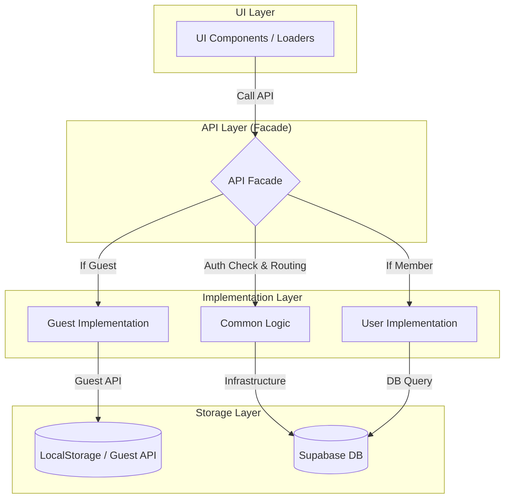

# MyVoca 데이터 흐름 설계 (4계층 아키텍처)

이 문서는 MyVoca 앱의 UI 레이어와 영속성 계층(DB/LocalStorage) 사이의 데이터 흐름 및 API 구조를 설명합니다.

---

## 1. 아키텍처 개요 (4-Tier Structure)

모든 데이터는 UI 레이어의 직접 접근을 차단하고, 중앙 집중식 API 레이어를 통해 관리됩니다.

| 계층 (Layer) | 역할 및 책임 | 주요 파일/폴더 |
| :--- | :--- | :--- |
| **1. UI Layer** | 화면 렌더링 및 사용자 이벤트 처리 | `src/pages/`, `src/components/` |
| **2. Facade API** | UI 진입점, 세션별 로직 분기 및 조율 | `src/api/voca.js`, `stats.js` |
| **3. Implementation** | 도메인별 상세 비즈니스 로직 구현 | `api/common/`, `api/guest/`, `api/user/` |
| **4. Infra / Storage** | 실제 물리적 데이터 저장 및 통신 | `common/supabase.js`, `guest/storage.js` |

---

## 2. 데이터 흐름 다이어그램 (Visual Flow)

---

## 3. 세부 데이터 플로우 상세

### A. 초기 진입 및 데이터 로드 (`loadUserData`)
1. **세션 확인**: `auth/session.js`를 호출하여 현재 로그인 상태를 판단합니다.
2. **데이터 오케스트레이션**:
   - **Common**: 마스터 단어 데이터와 전역 알림 정보를 공통으로 가져옵니다.
   - **Guest**: `guest/storage.js`에서 로컬에 저장된 학습 진행도를 가져옵니다.
   - **Member**: `user/voca.js` 및 `profile.js`를 통해 DB의 실시간 데이터를 가져옵니다.
3. **데이터 병합**: 가져온 로우 데이터들을 UI가 사용하기 쉬운 `wordMap` 형태로 변환(Processing)하여 반환합니다.
   - **난이도 코드 매핑 브릿지**: 프론트엔드의 `"default"` 난이도는 Supabase DB 및 로컬스토리지 템플릿 내의 초급 단어 레벨 번호인 `"700"`과 1:1 매핑되어 처리됩니다. API 및 로더 레이어에서 이 매핑 관계를 엄격히 준수하여 빈 배열 리턴 버그를 방지합니다.

### B. 학습 상태 업데이트 (`updateWordStatus`)
1. **UI 요청**: 사용자가 단어를 학습 완료하면 Facade의 `updateWordStatus`를 호출합니다.
2. **분기 처리**:
   - **Guest 유저**: `guest/voca.js`로 전달되어 로컬 스토리지의 해당 Day 데이터를 즉시 갱신합니다.
   - **Member 유저**: `user/voca.js`로 전달되어 Supabase `Voca` 테이블에 `upsert` 요청을 보냅니다.
3. **결과 반환**: 성공 여부를 UI에 응답하여 화면 상태를 갱신하도록 유도합니다.

### C. 데이터 이전 (Migration)
1. 사용자가 익명 상태에서 로그인하면 `user/migration.js`가 트리거됩니다.
2. `Guest Storage API`를 통해 로컬 데이터를 읽어와 DB로 대량 전송합니다.
3. 성공 시 로컬 데이터를 삭제하고, 이후 모든 요청은 `User` 경로를 따르게 됩니다.

---

## 4. 설계의 장점 (Benefits)
- **교체 용이성**: 저장소(예: 로컬 스토리지 → IndexedDB)를 바꾸더라도 UI 코드는 수정할 필요가 없습니다.
- **테스트 가능성**: 각 계층의 함수가 독립적으로 분리되어 유닛 테스트가 용이합니다.
- **일관성**: 모든 DB 접근이 `common/supabase.js`로 단일화되어 보안 및 설정 관리가 쉽습니다.
