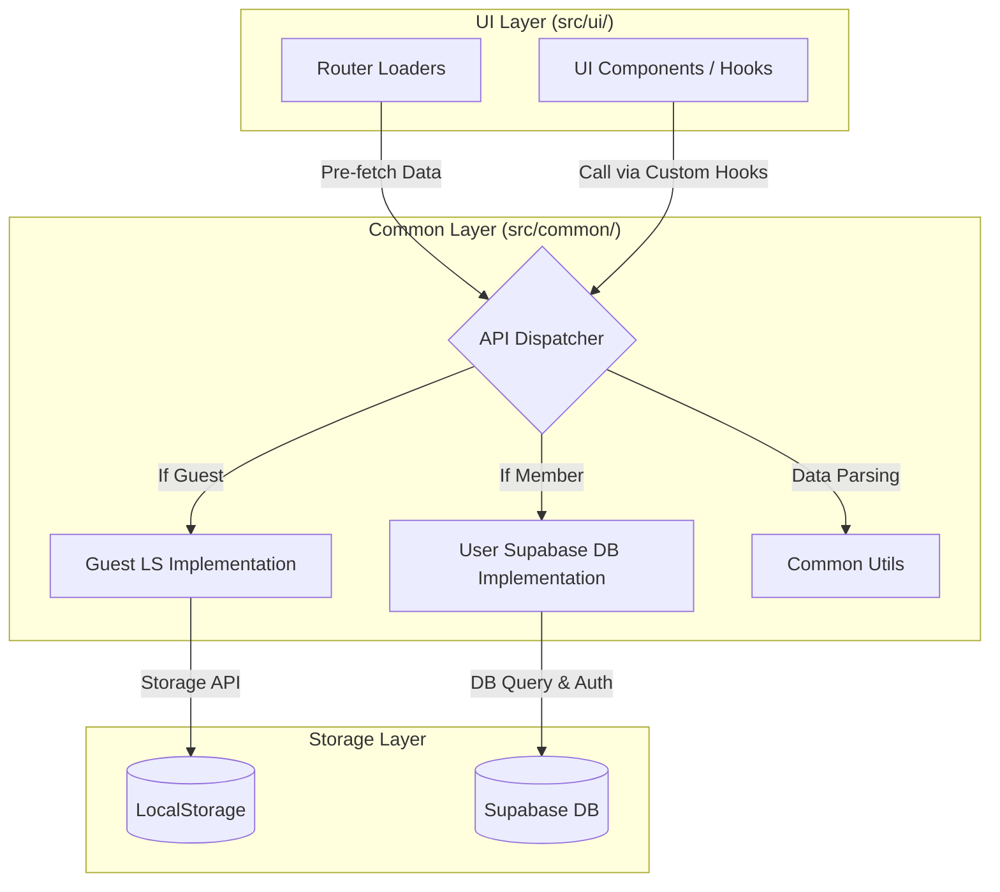

# MyVoca 데이터 흐름 설계 (3차 아키텍처)

이 문서는 MyVoca 앱의 UI 레이어, 공용 비즈니스 로직(API/Utils) 및 정적 에셋 레이어 간의 데이터 흐름과 아키텍처 구조를 설명합니다.

---

## 1. 아키텍처 개요 (3-Category Architecture)

모든 모듈은 관심사에 따라 3가지 최상위 카테고리로 엄격하게 분류되며, UI 레이어는 직접적인 저장소 접근 대신 공용 API 레이어를 통해 필요한 작업을 수행합니다.

| 카테고리 (Category) | 역할 및 책임 | 주요 폴더 및 명세 |
| :--- | :--- | :--- |
| **1. UI Layer (`src/ui/`)** | 화면 렌더링, 라우팅, 독립 도메인 Context 및 훅 관리 | `ui/services/`, `ui/common/`, `ui/app/` |
| **2. Common Layer (`src/common/`)** | API 클라이언트, 데이터 스토리지 제어(LS/Supabase), 공용 헬퍼 함수 | `common/api/`, `common/utils/` |
| **3. Assets Layer (`src/assets/`)** | 이미지, 공용 SVG 아이콘 리스트 등 정적 리소스 | `src/assets/` (예: `iconList.jsx`) |

---

## 2. 데이터 흐름 다이어그램 (Visual Flow)

---

## 3. 세부 데이터 플로우 상세

### A. 초기 진입 및 데이터 로드 (`loadUserData`)
1. **세션 확인**: `common/api/auth/session.js`를 호출하여 현재 로그인 상태를 판단합니다.
2. **데이터 오케스트레이션**:
   - **Common**: 마스터 단어 데이터와 전역 알림 정보를 공통으로 가져옵니다.
   - **Guest**: `common/api/guest/voca.js` 및 `storage.js`에서 로컬에 저장된 학습 진행도를 가져옵니다.
   - **Member**: `common/api/user/voca.js` 및 `profile.js`를 통해 DB의 실시간 데이터를 가져옵니다.
3. **데이터 병합**: 가져온 로우 데이터들을 UI가 사용하기 쉬운 `wordMap` 형태로 변환(Processing)하여 반환합니다.
   - **난이도 코드 매핑 브릿지**: 프론트엔드의 `"default"` 난이도는 Supabase DB 및 로컬스토리지 템플릿 내의 초급 단어 레벨 번호인 `"700"`과 1:1 매핑되어 처리됩니다. API 및 로더 레이어에서 이 매핑 관계를 엄격히 준수하여 빈 배열 리턴 버그를 방지합니다.

### B. 학습 상태 업데이트 (`updateWordStatus`)
1. **UI 요청**: 사용자가 단어를 학습 완료하면 커스텀 훅(`useVoca`)을 통해 API의 `updateWordStatus`를 호출합니다.
2. **분기 처리**:
   - **Guest 유저**: `common/api/guest/voca.js`로 전달되어 로컬 스토리지의 해당 Day 데이터를 즉시 갱신합니다.
   - **Member 유저**: `common/api/user/voca.js`로 전달되어 Supabase `Voca` 테이블에 `upsert` 요청을 보냅니다.
3. **결과 반환**: 성공 여부를 UI에 응답하여 화면 상태를 갱신하도록 유도합니다.

### C. 데이터 이전 (Migration)
1. 사용자가 익명 상태에서 로그인하면 `common/api/user/migration.js`가 트리거됩니다.
2. `storage.js`를 통해 로컬 데이터를 읽어와 DB로 대량 전송합니다.
3. 성공 시 로컬 데이터를 삭제하고, 이후 모든 요청은 `User` 경로를 따르게 됩니다.

---

## 4. 설계의 장점 (Benefits)
- **교체 용이성**: 저장소(예: 로컬 스토리지 → IndexedDB)를 바꾸더라도 UI 코드는 수정할 필요가 없습니다.
- **의존성 단방향 구조**: 프론트엔드 UI 레이어는 공용 비즈니스 로직을 자유롭게 가져다 쓸 수 있으나, 공용 비즈니스 로직 및 에셋 레이어는 리액트 UI 구조물에 대해 어떠한 직접적인 참조도 할 수 없습니다.
- **일관성**: 모든 DB 접근이 `common/api/common/supabase.js`로 단일화되어 보안 및 설정 관리가 쉽습니다.
- **아이콘 에셋 단일 진입점**: 모든 컴포넌트는 SVG 아이콘을 직접 내포하지 않고, `@/assets/iconList` 단일 파일에서 필요한 아이콘 컴포넌트를 가져와 사용함으로써 일관된 미려한 테마를 보장합니다.
