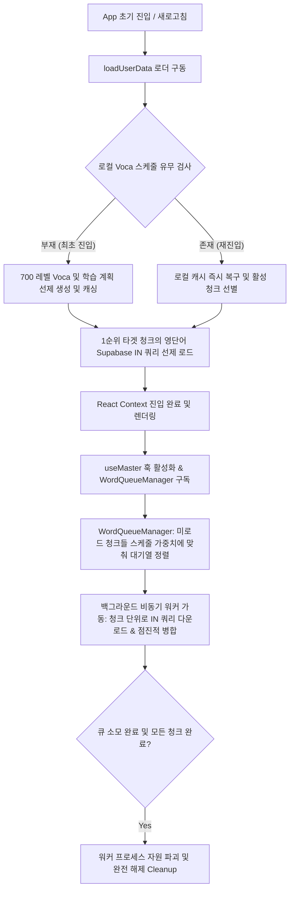

# 앱 데이터 로딩 및 동적 청크 스케줄링 아키텍처 명세서

본 문서는 funny-voca 애플리케이션의 영단어 및 학습 데이터에 대한 고성능 점진적 백그라운드 동적 로딩 아키텍처 사양을 기록합니다.

---

## 1. 아키텍처 개요

기존의 `BULK_SIZE`에 의존하여 무조건적으로 전체 영단어를 순차 스트리밍해오던 방식의 비효율성(네트워크 지연, 자원 누수, 대규모 페이징 조회)을 완전히 폐기했습니다. 
신규 아키텍처는 **스케줄 및 청크 데이터베이스에 정렬된 학습 계획을 우선순위로 매핑하여, 사용자가 지금 당장 암기해야 하거나 공부할 예정인 미로드 청크 단어들을 동적 우선순위 대기열(Priority Queue)에 적재하고 배치 쿼리(Supabase IN 쿼리)로 획득**하는 고성능 비동기 병렬화 구조를 가집니다.

---

## 2. 핵심 구성요소 상세 명세

### 1) 고수준 마스터 API 인터페이스 (`@api/master`)
- **역할**: `Chunk`, `Word`, `Definition` 등 핵심 어휘 원천 데이터를 감싸 외부 비즈니스 스케줄러와 격리시키는 최상위 마스터 데이터 게이트웨이.
- **주요 기능**:
  - `getWordsByChunk(wordIds)`: 단어 ID 목록을 수신하여 단 1회의 Supabase `IN` 쿼리로 영단어와 뜻의 조인 데이터를 획득합니다. 페이징 래퍼(`fetchPages`)의 관성을 완전히 영구 배제하여 10~20ms 이내의 극도로 가벼운 성능을 실현합니다.
  - `getAllChunks()`: 전체 스케줄링의 기초가 되는 Chunk 리스트를 획득합니다.
  - `getInitialScheduleData(level)`: 초기화/진입에 필요한 스케줄 기준 테이블과 타겟 레벨 청크를 병렬 쿼리합니다.

### 2) 전역 Singleton 큐 매니저 (`WordQueueManager`)
- **역할**: 컴포넌트 생명주기(마운트/언마운트)에 영향을 받지 않고 백그라운드 단어 적재를 도맡는 단일 백그라운드 워커.
- **동적 우선순위 정렬 및 비집고 들어가기 (Priority Re-queue)**:
  - 큐 적재 대기열(`queue`)은 항상 다음 가중치로 최우선 정렬(Re-sort)됩니다:
    1. 사용자가 현재 선택하여 바로 단어 암기를 시작하는 액티브 청크 (`profile.selected` 청크)
    2. 학습 정렬 권장 순번(`schedule`)이 빠른 미다운로드 청크들
  - 사용자가 700 레벨 학습 도중 800 레벨로 난이도를 확장하거나, 카테고리를 맞교환(Swap)하여 스케줄이 재배정되면, 매니저가 즉시 전체 미다운로드 청크의 가중치를 재평가하여 큐를 재정렬합니다. 새로 편입된 청크들이 대기열 정렬 순서대로 순식간에 **비집고 들어와(Re-queue)** 최우선 처리됩니다.
- **자원 자동 해제 (Cleanup)**:
  - 모든 미로드 청크의 단어가 전부 로드되어 큐가 텅 비게 되는 시점에 내부 `activeWorker` 핸들러를 즉시 `null`로 완전히 파기하여 스레드 및 타이머 리소스 누수를 사전에 영구 차단합니다.

### 3) 넌블로킹 브릿지 훅 (`useMaster`)
- **역할**: `WordQueueManager`가 백그라운드에서 청크를 디큐하여 가져올 때마다 이를 구독(Subscribe)하여 리액트 전역 단어 상태(`master`)에 점진적으로 누적 병합해주는 인터페이스 브릿지.
- **메모리 안정성**: 마운트 시 리스너를 바인딩하고, 컴포넌트 언마운트 시 안전하게 구독을 파괴(`unsubscribe()`)하여 리스너 메모리 릭을 방지합니다.

---

## 3. 예외 상황 처리 및 무결성 보장

- **초기 진입 선제 빌드**:
  - 기존 Welcome 단계에서 가짜 생성 지연(Spinner)을 주며 학습 데이터를 늦게 생성하던 단점을 보완하여, 로더(`loadUserData`) 단계에서 미리 700 레벨 Voca 스케줄을 빌드해두고 1순위 청크 단어까지 선제적으로 즉시 다운로드해 둡니다. 이로 인해 최초 사용자가 대시보드에 안착하는 첫 마운트 순간에 이미 단어가 준비되어 있습니다.
- **네트워크 순단 대비 오프라인 커밋**:
  - 매 청크 로딩이 성공하는 틱마다 로컬 스토리지 마스터 캐시(`KEYS.MASTER`)에 점진적으로 커밋을 고정하여, 다운로드 도중 오프라인 상태가 되더라도 기획상 확보된 단어 학습의 무결성이 영구히 보존됩니다.
