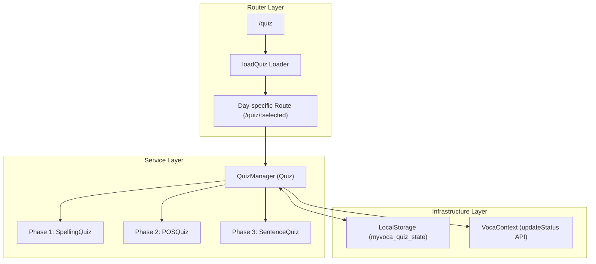
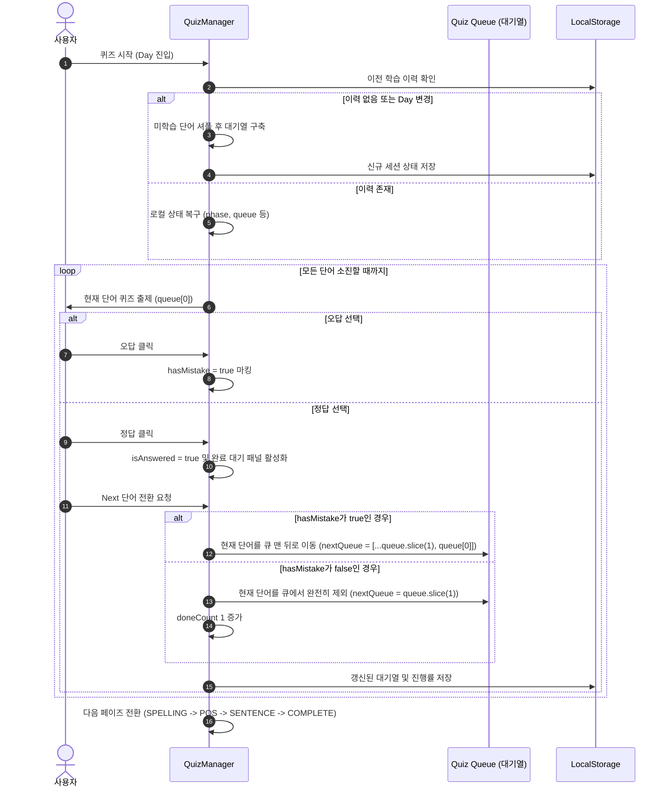

# Quiz Service Architecture & Specifications (퀴즈 서비스 설계 및 명세)

본 문서는 MyVoca 어플리케이션의 독립된 퀴즈 서비스의 구조, 라운드 순회 알고리즘, 로컬 스토리지 데이터 포맷 및 3단계 퀴즈의 실행 흐름을 명세합니다.

---

## 1. System Architecture Diagram (시스템 아키텍처 구성도)



---

## 2. Core Business Logic: Round Queue Algorithm (라운드형 대기열 알고리즘)

사용자가 문제를 완벽하게 소화할 때까지 틀린 단어를 맨 뒤로 배치하여 지속적으로 복습을 유도하는 구조입니다.



---

## 3. LocalStorage State Format (로컬 스토리지 데이터 규격)

사용자의 진행 상황을 보존하기 위해 로컬 스토리지의 `myvoca_quiz_state` 키에 다음 규격의 JSON 오브젝트를 저장합니다:

```json
{
  "day": 1,
  "phase": "SPELLING",
  "doneCount": 2,
  "totalCount": 10,
  "queue": [204, 209, 215, 201],
  "targetWordIds": [201, 202, 203, 204, 205, 206, 207, 208, 209, 210]
}
```

### 필드 설명
- **`day` (Number)**: 사용자가 현재 플레이 중인 Day 정보
- **`phase` (String)**: 진행 단계 (`"SPELLING"` | `"POS"` | `"SENTENCE"` | `"COMPLETE"`)
- **`doneCount` (Number)**: 이번 페이즈에서 한 번에 맞추어 통과를 완료해 낸 단어의 개수 (진행률 바의 `done` 값으로 매핑)
- **`totalCount` (Number)**: 전체 학습해야 할 단어 개수
- **`queue` (Array of Number)**: 현재 페이즈에서 아직 맞춰야 하는 단어 ID들의 리스트 (틀릴 경우 이 리스트 뒤로 밀려남)
- **`targetWordIds` (Array of Number)**: 학습 세션 시작 시 지정된 이번 퀴즈의 전체 대상 단어 ID 리스트 (페이즈 변경 시 큐를 셔플 재생성하기 위해 사용)

---

## 4. UI/UX Rules & Styling Details

1. **품사 한국어화**: 
   단어 데이터의 원본 품사 표기(`"n."`, `"v."`, `"a."`, `"ad."`)는 2단계 품사 퀴즈에서 각각 `"명사"`, `"동사"`, `"형용사"`, `"부사"`로 변환되어 사용자에게 표기됩니다.
2. **진행률 바 독립 운영**:
   전체 3개 단계를 아우르는 통합 진행률 바 대신, 페이즈(Phase)가 바뀔 때마다 진행률 바가 다시 `0%`부터 시작하여 학습 단계의 시각적 명료성을 확보합니다.
3. **전역 완료 지연 업데이트**:
   1~3단계 퀴즈를 모두 통과하기 전까지 단어의 전역 `done` 상태는 갱신되지 않으며, 마지막 3단계를 모두 클리어해야만 서버와 연결되어 학습 완료 처리됩니다.
