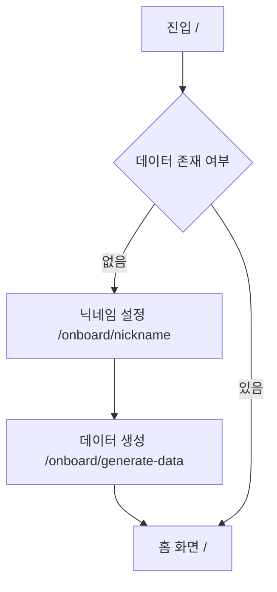

# UI 흐름 분석 (UI Flow Analysis)

이 문서는 MyVoca 애플리케이션의 사용자 여정과 네비게이션 구조를 설명합니다.

## 1. 온보딩 흐름 (신규 사용자)
신규 사용자가 메인 대시보드에 접근하기 전 거치는 설정 단계입니다.



- **닉네임 설정 (StepToNick)**: 사용자의 이름을 입력받는 화면입니다. (`src/ui/common/setup/StepToNick.jsx`)
- **데이터 생성 (StepToData)**: 초기 단어 맵을 생성하고 저장하는 동안 진행 바를 보여주는 전환 화면입니다. (`src/ui/common/setup/StepToData.jsx`)

## 2. 메인 네비게이션 (App Layout)
온보딩이 완료된 사용자는 상단 `Header`와 하단 `Navigation`바가 고정된 메인 레이아웃 내에 머물게 됩니다.

### 네비게이션 탭:
1. **홈 (`/home`)**:
   - 학습 통계(`UserDataSection`) 표시.
   - 현재 학습해야 할 Day로 바로 이동하는 `PlayButton`.
   - 학습 기록을 보여주는 `Calendar`.
2. **단어장 (`/voca`)**:
   - **VocaList**: 전체 학습 세트(Day 1, Day 2 등) 목록 표시.
   - **WordList**: 특정 Day를 선택하여 포함된 단어들을 상세 조회.
3. **학습하기 (`/play`)**:
   - `userData.selected` 값을 기반으로 현재 학습 중인 세트로 자동 리다이렉트.

## 3. 학습(Play) 모드 흐름
학습 모드는 **카드(Card)** 학습과 **퀴즈(Quiz)** 학습 두 단계로 나뉩니다.

```mermaid
graph LR
    PlayEntry[/play/:id] --> CardMode[/play/:id/card/:step]
    CardMode --> QuizMode[/play/:id/quiz/:step]
    QuizMode --> Complete[학습 완료 화면]
```

- **카드 모드 (Card Mode)**:
  - 암기 중심의 학습.
  - 카드를 클릭하여 뜻을 확인하고 다음 단어로 진행.
- **퀴즈 모드 (Quiz Mode)**:
  - 학습 내용 확인.
  - 객관식/주관식 형태의 문제 풀이.
  - 몰입감을 위해 `CircleTimer` 사용.
- **학습 완료 화면 (Complete)**: 세션 결과(정답률 등)를 보여주고 홈으로 돌아가거나 다음 단계를 선택.

## 4. 디자인 패턴
- **글래스모피즘 (Glassmorphism)**: 은은한 배경과 반투명 레이어를 사용한 현대적인 디자인.
- **마이크로 애니메이션**: 카드 뒤집기, 진행 바 업데이트 등 부드러운 화면 전환.
- **반응형 레이아웃**: 모바일 퍼스트 디자인을 지향하되 데스크탑 환경에서도 최적화된 화면 제공.
