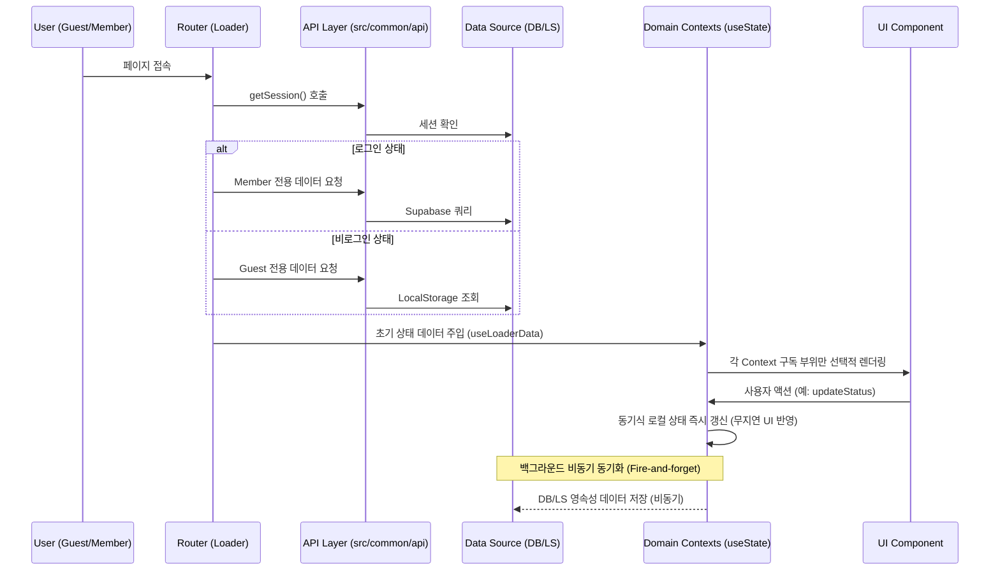

# MyVoca Service Architecture & Guide

본 문서는 MyVoca 프로젝트의 전체 서비스 구조와 핵심 설계 원칙을 에이전트에게 제공하기 위한 가이드입니다. 다른 챗 세션 및 독립 에이전트가 투입되었을 때에도 아키텍처적 일관성을 보존하기 위한 Single Source of Truth(SSOT) 역할을 수행합니다.

---

## 1. 서비스 계층 구조 (Service Layers - 3차 아키텍처 규격)

MyVoca는 컴포넌트 복잡성을 극복하기 위해 역할을 프론트엔드 UI, 비즈니스 공용 로직, 정적 리소스로 명확히 나눈 **3차 카테고리(src/ui, src/common, src/assets)** 디렉토리 구조를 따릅니다.

### Layer 1: 프론트엔드 UI 및 스타일 레이어 (`src/ui`)
사용자 화면 렌더링 및 상태(State) 구독, 라우팅을 관장하는 리액트 레이어입니다.
*   **`src/ui/app/`**: 애플리케이션의 핵심 엔트리 및 공통 설정을 포함합니다.
    *   `App.jsx`: 공통 레이아웃 구조화 및 도메인별 4대 독립 컨텍스트 공급자 배치.
    *   `GlobalStyle.js`: 글로벌 CSS 규칙 선언.
    *   `router/`: 전체 경로 라우팅 매핑 (`router.jsx`), 로더 및 헬퍼 함수 (`play/`, `user/`).
*   **`src/ui/common/`**: 공용 UI 부품, 공통 모듈식 레이아웃 및 훅 레이어입니다.
    *   `components/`: 버튼, 진행바 등 범용 순수 컴포넌트.
    *   `layout/`: 헤더, 네비게이션 등 메인 골격 레이아웃.
    *   `hooks/`: UI 전반에 공유되는 리액트 훅 (`useWord.jsx`, `useMyParam.js`, `useTheme.js` 등).
    *   `setup/`: 온보딩 단계(`StepToNick`, `StepToData`) 전용 컴포넌트.
*   **`src/ui/services/`**: 도메인별 주요 서비스 화면 및 전용 스타일입니다.
    *   서비스 디렉토리 하위에 화면 구성 파일과 스타일 파일(`*.styles.js`)을 모듈로 묶어 관리합니다.
    *   *분류*: `Home/`, `Play/`, `Voca/`, `Settings/`.

### Layer 2: 비즈니스 공용 API 및 유틸리티 레이어 (`src/common`)
UI 라이브러리(React)에 의존하지 않고 어디서나 가져다 쓸 수 있는 비즈니스 및 유틸리티 엔진입니다.
*   **`src/common/api/`**: 데이터 영속성 관리를 위한 추상화 API 레이어 (Facade 패턴).
    *   `auth/`: 사용자 계정 정보 및 인증/세션 제어.
    *   `guest/`: 비로그인 사용자를 위한 로컬 저장소(`LocalStorage`) CRUD.
    *   `user/`: 로그인 사용자를 위한 Supabase 리모트 데이터베이스 CRUD.
    *   `voca.js`: 회원/게스트 통일 상태 갱신 인터페이스.
*   **`src/common/utils/`**: 수학적 계산, 난수 셔플 등 순수 알고리즘 헬퍼 함수 (`utils.js` 등).

### Layer 3: 정적 리소스 및 에셋 레이어 (`src/assets`)
*   **`src/assets/`**: 애플리케이션 전반에서 사용하는 고해상도 SVG 아이콘 집합 (`iconList.jsx`) 및 미디어 파일.

---

## 2. 핵심 데이터 흐름 (Core Data Flow)

---

## 3. 핵심 설계 및 코드 작성 규칙

1.  **로더 중심 데이터 초기화**: 컴포넌트 내부의 `useEffect` 데이터 패칭을 완전히 배제하고, `Router Loader`에서 사전에 필수 데이터를 로드하여 최상위 컨텍스트의 초기값으로 바인딩합니다.
2.  **동기식 낙관적 업데이트 & 백그라운드 동기화**:
    *   사용자의 조작(단어 학습 체크, 퀴즈 정답 등) 시 무지연 반응을 제공하기 위해 로컬 뷰 상태를 동기적으로 즉시 선(先) 반영합니다.
    *   원격/로컬 스토리지에 데이터를 쓰는 비동기 로직은 훅 내에서 백그라운드로 처리(fire-and-forget)됩니다.
    *   데이터 쓰기 실패 시 콘솔 에러 외에 별도 롤백 처리를 하지 않으며, 추후 로더 재호출 시 자동 보정됩니다.
3.  **도메인 Context 기반 관심사 분격**: 단일 거대 Context 체계를 탈피하고 관심사별(`VocaContext`, `ProfileContext`, `StatsContext`, `AppContext`)로 독립 구독하도록 설계하여 렌더링 부하를 극대화로 감소시킵니다.
4.  **UI-로직 철저한 격리 (의존성 단방향화)**:
    *   `src/common/` 하위 소스 코드는 어떠한 경우에도 `src/ui/` 하위 소스 코드를 참조(import)할 수 없습니다.
5.  **난이도 매핑 브릿지 규칙**:
    *   프론트엔드 UI의 초급 난이도 표기인 `"default"`는 Supabase 테이블 및 게스트 템플릿의 단어 레벨 번호인 `"700"`과 1:1로 엄격하게 맵핑됩니다. 임의 변경으로 인한 조회 실패 오류를 철저히 방지해야 합니다.
6.  **Supabase 페이징 헬퍼 필수 사용**:
    *   Supabase JS Client의 1,000행 초과 조회 제한을 우회하기 위해, `src/common/api/common/supabase.js`의 `fetchPages` 헬퍼 함수를 반드시 적용하여 3,600개 이상의 마스터 데이터나 누적 유저 통계 정보를 안전하게 수집해야 합니다.
7.  **JSDoc 및 스타일 분리 규칙**:
    *   모든 API 및 유틸리티 함수에는 인자 및 반환 타입을 문서화하는 JSDoc을 충실히 작성합니다.
    *   Styled Component는 반드시 동일 폴더 내의 `[ComponentName].styles.js`로 분리하여 코드의 가독성을 극대화합니다.
