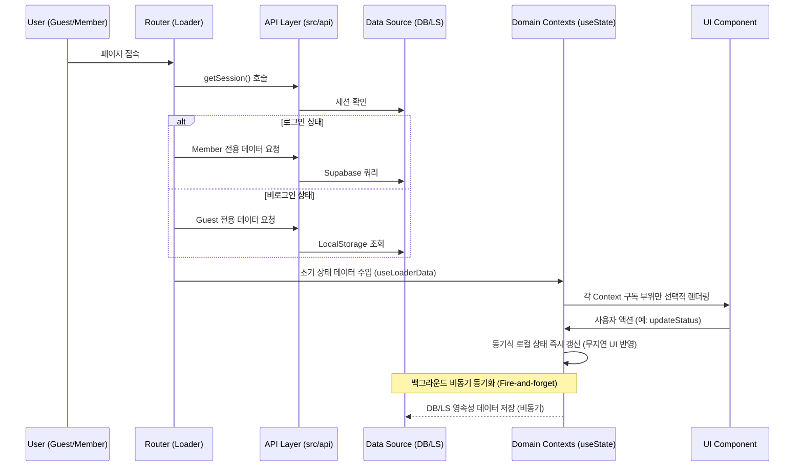

# MyVoca Service Architecture & Guide

본 문서는 MyVoca 프로젝트의 전체 서비스 구조와 핵심 설계 원칙을 에이전트에게 제공하기 위한 가이드입니다.

## 1. 서비스 계층 구조 (Service Layers)

MyVoca는 다음과 같은 4단계 계층 구조로 동작합니다.

### Layer 1: Router & Loaders (`src/router`)
- **역할**: URL 기반 페이지 전환 및 진입 전 필수 데이터 로드(Hydration).
- **핵심 파일**:
  - `src/router/user/index.js`: `loadUserData` (사용자 세션/프로필/학습 데이터 통합 로더).
  - `src/router/user/utils.js`: 데이터 가공용 순수 함수.

### Layer 2: API Layer (`src/api`)
- **역할**: 데이터 소스(Supabase, LocalStorage) 접근 로직 추상화 및 모듈화.
- **구조**:
  - `auth/`: 세션 및 인증 관리.
  - `user/`: 회원 프로필 및 학습 데이터(DB) 접근.
  - `guest/`: 게스트 스토리지(LocalStorage) 제어.
  - `voca.js`: 회원/게스트 통합 업데이트 인터페이스.

### Layer 3: UI & Components (`src/pages`, `src/components`)
- **역할**: UI 렌더링 및 사용자 인터랙션 처리.
- **핵심 아키텍처**: 글로벌 `useOutletContext` 전파 방식을 폐기하고, 도메인별로 완벽하게 관심사가 분리된 4종 독립 Context(`VocaContext`, `ProfileContext`, `StatsContext`, `AppContext`)를 `useContext`로 필요한 만큼만 개별 구독합니다. 이로써 불필요한 전체 리렌더링을 차단하고 계층 구조를 최적화합니다.
- **핵심 훅**:
  - `useWord.jsx`: 특정 Day의 단어 리스트와 학습 상태(done)를 연결하는 브릿지. (Voca/Stats/AppContext 구독)

### Layer 4: Infrastructure & Utils (`src/utils`)
- **역할**: 저수준 유틸리티(날짜 계산, 배열 셔플 등) 및 외부 라이브러리 설정.

## 2. 핵심 데이터 흐름 (Core Data Flow)

## 3. 핵심 설계 규칙
1. **로더 중심 데이터 초기화**: 컴포넌트 내부의 `useEffect` 데이터 패칭을 지양하고, Router Loader에서 필요한 필수 데이터군을 미리 확보하여 최상위 Context 상태의 초기값으로 주입합니다.
2. **동기식 낙관적 업데이트 & 백그라운드 동기화**: 
   - 사용자의 클릭(단어 완료, 퀴즈 정답 등) 시 UI 반응 속도 극대화를 위해 UI 상태(`useState`)를 동기적으로 선(先) 반영합니다.
   - 실제 서버 DB 또는 로컬스토리지 저장은 훅 내부에서 비동기(fire-and-forget)로 백그라운드 실행되어 은닉화됩니다.
   - 실패 시에는 별도의 UI 롤백 없이 콘솔 에러 로깅 처리하며, 다음 앱 진입(Loader 재실행) 시 서버/스토리지 데이터 기준으로 자동 보정됩니다.
3. **도메인 Context 기반 관심사 격리**: 단일 거대 Context 대신 관심사별(`VocaContext`, `ProfileContext`, `StatsContext`, `AppContext`)로 쪼개어 특정 도메인의 상태 변화가 다른 도메인을 구독하는 UI 컴포넌트의 무의미한 리렌더링을 유발하지 않도록 설계합니다.
4. **API 추상화**: UI 컴포넌트는 데이터 소스(DB vs LS)를 직접 알지 못하며, `src/api`에서 제공하는 통합 인터페이스를 사용합니다.
5. **JSDoc 의무화**: 모든 API와 유틸리티 함수에는 매개변수와 반환 타입을 명시하여 데이터 무결성을 보장합니다.
6. **순수 함수 지향**: 비즈니스 로직(가공, 필터링 등)은 부수 효과가 없는 순수 함수로 작성하여 `utils` 폴더에서 관리합니다.
7. **난이도 매핑 제약 조건 (default ↔ 700)**: 프론트엔드의 `"default"` 난이도는 데이터베이스(Supabase) 및 게스트 저장소 템플릿 내의 초급 단어 레벨 번호인 `"700"`과 1:1 매핑됩니다. API 레이어와 Router Loader 레이어는 이 매핑 브릿지를 항상 명확히 유지해야 하며, 키 불일치로 인한 빈 배열 반환 오류를 방지해야 합니다.
8. **Supabase 대용량 데이터 조회 페이징 (1,000 Limit 우회)**: Supabase JS Client의 기본 select 한도는 1,000개입니다. 3,600개 이상으로 구성된 `Word` 마스터 테이블이나 1,000개 이상의 행이 쌓일 수 있는 `Voca` 유저 학습 정보 테이블을 조회할 때 데이터 유실이 발생하지 않도록, `src/api/common/supabase.js`의 `fetchPages` 페이징 헬퍼 함수를 필수적으로 사용하여 모든 데이터를 완전히 수집하도록 보장합니다.

